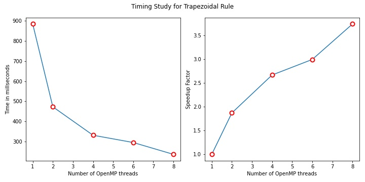

<h1> ME766: Assignment 1

<h3>Mohd Safwan

17D0700047

## Analytical Integral
$$
\begin{aligned}
    \int_{-\frac{\pi}{2}}^{\frac{\pi}{2}} f(x) dx &= \int_{-\frac{\pi}{2}}^{\frac{\pi}{2}} \cos(x) dx\\&= \Big[ sin(x) \Big]_{-\frac{\pi}{2}}^{\frac{\pi}{2}}\\
    &= \sin\left(\frac{\pi}{2}\right) - \sin\left(-\frac{\pi}{2}\right)\\
    &=  2
\end{aligned}
$$

## Convergence Study

### Trapezoid Rule

| Divisions | Integral | % Error |
|-|-|-|
| 4 | 1.89612 | 5.194 |
| 8 | 1.97423 | 1.2885 |
| 16 | 1.99357 | 0.3215 |
| 32 | 1.99839 | 0.0805 |
| 64 | 1.9996 | 0.02 |
| 128 | 1.9999 | 0.005 |
| 256 | 1.99997 | 0.0015 |
| 512 | 1.99999 | 0.0005 |
| 1024 | 2 | 0 |

   

### Monte Carlo Method

| Samples | Integral | % Error |
|-|-|-|
| 10 | 2.53822 | 26.911 |
| 100 | 2.0529 | 2.645 |
| 1000 | 1.94344 | 2.828 |
| 10000 | 1.99578 | 0.211 |
| 100000 | 1.99725 | 0.1375 |
| 1000000 | 1.99913 | 0.0435 |
| 10000000 | 1.99984 | 0.008 |
| 100000000 | 1.99984 | 0.008 |
| 1000000000 | 1.99998 | 0.001 |

   

## Timing Study

| Experiment | Average Time (ms) |
|:-:|:-:|
| Trapezoid Serial | 884 |
| Trapezoid Parallel 2 Threads | 472.6 |
| Trapezoid Parallel 4 Threads | 331.4 |
| Trapezoid Parallel 6 Threads | 295.2 |
| Trapezoid Parallel 8 Threads | 236.4 |
| Monte Carlo Serial | 3423.4 |
| Monte Carlo Parallel 2 Threads | 1782.6 |
| Monte Carlo Parallel 4 Threads | 1121.8 |
| Monte Carlo Parallel 6 Threads | 1085.6 |
| Monte Carlo Parallel 8 Threads | 1080.2 |

   
   

