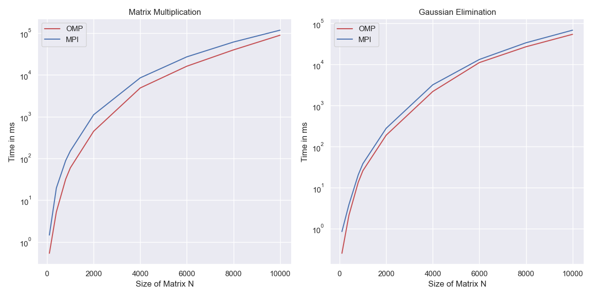

<center>

<h1> ME766: Assignment 2

<h3>Mohd Safwan

17D0700047
</center>

## Matrix Multiplication

-  The simple $\mathcal{O}(N^3)$ matrix multiplication algorithm is pretty straightforward to implement

    ```C++
    void multiply(float A[N][N], float B[N][N], float C[N][N]) {
        // Caclulates C = AB where C is initialized to a zero matrix
        int i, j, k;
        for (i = 0; i < N; i++)
            for (j = 0; j < N; j++)
                for (k = 0; k < N; k++)
                    C[i][j] += A[i][k] * B[k][j];
    }
    ```

- ### Fixing the cache misses
    However we can see that ```A[i][k]``` is being used in the last loop but the value of ```k``` keeps changing on every iterations resulting in a **Cache Miss** everytime. Fixing this by swapping the last 2 loops gives us an almost **5x** speedup.

    ```C++
    void multiply(float A[N][N], float B[N][N], float C[N][N]) {
        // Caclulates C = AB where C is initialized to a zero matrix
        int i, j, k;
        for (i = 0; i < N; i++)
            for (k = 0; k < N; k++)
               for (j = 0; j < N; j++)
                    C[i][j] += A[i][k] * B[k][j];
    }
    ```
- ### OMP Implementation
    
    Since there is no explicit data dependency, we can just distribute the operations of outer-most loop over threads arbitrarily.
    ```C++
    void multiply(float A[N][N], float B[N][N], float C[N][N]) {
        int i, j, k;
    #pragma omp parallel for private(j, k)
        for (i = 0; i < N; i++)
            for (k = 0; k < N; k++)
                for (j = 0; j < N; j++) C[i][j] += A[i][k] * B[k][j];
    }
    ```

- ### MPI Implementation
    - I have divided the $A$ matrix into horizontal strips of almost equal lenghts, the number of division is equal to number of processors.
    - The $0^\text{th}$ node (```MASTER```) is responsible for doing the division and sending the strips of $A$. It also keeps one strip for itself.
    - Each node/processor $i$ receives a copy of $B$ and the horizontal strip $A_i$ of $A$ that it has been assigned.
    - Each node then calculates a strip of $C$ that is $C_i = A_i B$ and sends it back to ```MASTER```.
    - ```MASTER``` node collects all $C_i$ strips and place them in the $C$ matrix at correct locations.


## Gaussian Elimination

-   Converting any invertible matrix to an upper triangular matrix is easy with the simple **Gauss Jordan Elimination** algorithm. The code is very straighforward for now.
    ```C++
    void gaussianElimination(float R[N][N]) {
        float r;
        int i, j, k;
        for (i = 0; i < N; i++) {
            for (j = i + 1; j < N; j++) {
                r = R[j][i] / R[i][i];
                for (k = i; k < N; k++) R[j][k] -= r * R[i][k];
            }
        }
    }
    ```

- ### OMP Implementation
    There is obvious data dependency in the first loop, the elimination has to be done in correct order. The pivot must be chosen from first row, then second, and so on. However, for all the rows below pivot row, we can parallelize the calculation of ratio and substraction of rows.

    ```C++
    void gaussianElimination(float R[N][N]) {
        float r;
        int i, j, k;
        for (i = 0; i < N; i++) {
    #pragma omp parallel for private(r, k)
            for (j = i + 1; j < N; j++) {
                r = R[j][i] / R[i][i];
                for (k = i; k < N; k++) R[j][k] -= r * R[i][k];
            }
        }
    }
    ```
- ### MPI Implementation
  One obvious way to parallelize would be that when we want to substract the pivot row from the rows below it, that operation can be distributed between nodes. However this would require division of the remaining rows $\mathcal{O}(N)$ times and as many times sending the row strips to different nodes. 
  <br>  I have gone with a different approach.
  - Every node is assigned a fixed set of rows from $C$, all the computations required for any of these rows will only be performed here.
  - I keep track of how many rows to we need to modify in each node while doing the elimination.
  - I have kept track of which node has the next pivot row, after each step of elimination, that row is asked by ```MASTER``` to send the next pivot row.
  - ```MASTER``` receives the next pivot row from one of the nodes and places it in the $C$ matrix at correct position.
  - The work distribution is not uniform since more work is required to be done ton lower rows, but actually this method performs better since we only have to sed/receive $\mathcal{O}(N)$ floats every iteration instead of $\mathcal{O}(N^2)$ in the other method.

## Timing Analysis

- ### Scaling with $N$
    <div align='center'>
    
    </div>

    As we can see, MPI is a little slower than OpenMP but scales very similarly with $N$. The largest problem size $N=10000$ was easily completed within 100 seconds.

- ### Scaling with Threads

    <div align='center'>
    
    </div>
    The plot for OMP Matrix Multiplication looks as expected, but there was a consistent jump at 5 threads while performing Gaussian Elimination. The same jump is present in both graphs for MPI as well. This may be due to the fact that after 4 physical cores, the framework uses hyperthreading for parallelization and thus there should be some overhead for that, which may be negligible for the first task.

## Hardware Information

- ### CPU
        Architecture:        x86_64
        CPU op-mode(s):      32-bit, 64-bit
        Byte Order:          Little Endian
        CPU(s):              8
        On-line CPU(s) list: 0-7
        Thread(s) per core:  2
        Core(s) per socket:  4
        Socket(s):           1
        NUMA node(s):        1
        Vendor ID:           GenuineIntel
        CPU family:          6
        Model:               79
        Model name:          Intel(R) Xeon(R) CPU E5-2686 v4 @ 2.30GHz
        Stepping:            1
        CPU MHz:             2698.391
        CPU max MHz:         3000.0000
        CPU min MHz:         1200.0000
        BogoMIPS:            4600.18
        Hypervisor vendor:   Xen
        Virtualization type: full
        L1d cache:           32K
        L1i cache:           32K
        L2 cache:            256K
        L3 cache:            46080K
        NUMA node0 CPU(s):   0-7

- ### OS
        NAME="Amazon Linux"
        VERSION="2"
        ID="amzn"
        ID_LIKE="centos rhel fedora"
        VERSION_ID="2"
        PRETTY_NAME="Amazon Linux 2"
        ANSI_COLOR="0;33"
        CPE_NAME="cpe:2.3:o:amazon:amazon_linux:2:-:internal"
        HOME_URL="https://amazonlinux.com/"
        VARIANT="internal"

