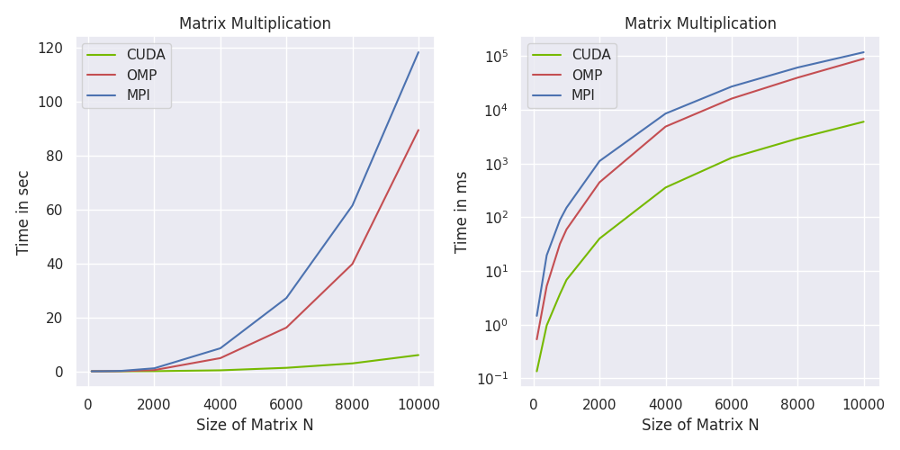

<center>

<h1> ME766: Assignment 3

<h3>Mohd Safwan

17D0700047
</center>

## Implementation
The is the simple $\mathcal{O}(N^3)$ matrix multiplication algorithm.

```C++
void multiply(float A[N][N], float B[N][N], float C[N][N]) {
    // Caclulates C = AB where C is initialized to a zero matrix
    int i, j, k;
    for (i = 0; i < N; i++)
        for (j = 0; j < N; j++)
            for (k = 0; k < N; k++)
                C[i][j] += A[i][k] * B[k][j];
}
```

For parallelizing it using CUDA, I have distributed the outer 2 for loops to parallel threads. Each thread computes the value $C_{ij}$ or ```C[i][j]``` by performing a dot product.

The CUDA implementation is pretty straighforward.

```C
__global__ void multiply(float* A, float* B, float* C) {
    int idx = blockIdx.x * blockDim.x + threadIdx.x;
    if (idx >= N * N) return;
    int i = idx / N, j = idx % N;
    for (int k = 0; k < N; k++) C[i * N + j] += A[i * N + k] * B[k * N + j];
    return;
}
```

## Timing Analysis

- ### Scaling with $N$
    <div align='center'>
    
    </div>

    As we can see, CUDA scales very similarly with $N$ and has the best performance as expected.

- ### Scaling with Threads per Block

    <div align='center'>
    
    </div>

    The ```TPB``` parameter is very important as visible in the graph, above a certain threshold it gives more or less the same performance.

## Hardware Information

```bash
 CUDA Device Query (Runtime API) version (CUDART static linking)

Detected 1 CUDA Capable device(s)

Device 0: "NVIDIA GeForce GTX 1650"
  CUDA Driver Version / Runtime Version          11.3 / 11.0
  CUDA Capability Major/Minor version number:    7.5
  Total amount of global memory:                 3912 MBytes (4101898240 bytes)
  (16) Multiprocessors, ( 64) CUDA Cores/MP:     1024 CUDA Cores
  GPU Max Clock rate:                            1560 MHz (1.56 GHz)
  Memory Clock rate:                             4001 Mhz
  Memory Bus Width:                              128-bit
  L2 Cache Size:                                 1048576 bytes
  Maximum Texture Dimension Size (x,y,z)         1D=(131072), 2D=(131072, 65536), 
  3D=(16384, 16384, 16384)
  Maximum Layered 1D Texture Size, (num) layers  1D=(32768), 2048 layers
  Maximum Layered 2D Texture Size, (num) layers  2D=(32768, 32768), 2048 layers
  Total amount of constant memory:               65536 bytes
  Total amount of shared memory per block:       49152 bytes
  Total number of registers available per block: 65536
  Warp size:                                     32
  Maximum number of threads per multiprocessor:  1024
  Maximum number of threads per block:           1024
  Max dimension size of a thread block (x,y,z): (1024, 1024, 64)
  Max dimension size of a grid size    (x,y,z): (2147483647, 65535, 65535)
  Maximum memory pitch:                          2147483647 bytes
  Texture alignment:                             512 bytes
  Concurrent copy and kernel execution:          Yes with 3 copy engine(s)
  Run time limit on kernels:                     Yes
  Integrated GPU sharing Host Memory:            No
  Support host page-locked memory mapping:       Yes
  Alignment requirement for Surfaces:            Yes
  Device has ECC support:                        Disabled
  Device supports Unified Addressing (UVA):      Yes
  Device supports Managed Memory:                Yes
  Device supports Compute Preemption:            Yes
  Supports Cooperative Kernel Launch:            Yes
  Supports MultiDevice Co-op Kernel Launch:      Yes
  Device PCI Domain ID / Bus ID / location ID:   0 / 1 / 0
  Compute Mode:
     < Default (multiple host threads can use ::cudaSetDevice() with device simultaneously) >

deviceQuery, CUDA Driver = CUDART, CUDA Driver Version = 11.3, 
CUDA Runtime Version = 11.0, NumDevs = 1
Result = PASS
```
